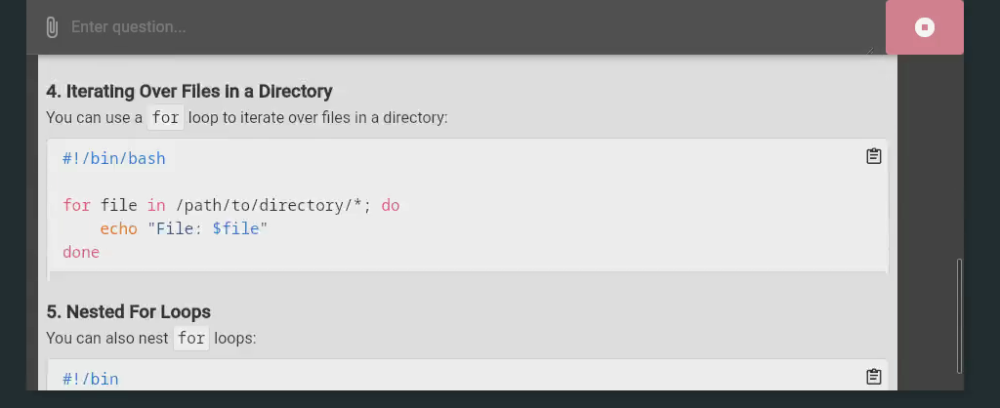

# Ask m' AI

**Ask m' AI** (ask my ai -> ask m' ai) is a little Desktop-Chat-Application for LargeLanguageModels (e.g. OpenAI's GPT).

Unlike many chat applications out there, this application aims to be scriptable. 
Which means you can call it from you terminal and gave all necessary options as arguments. 
The conversations will also be printed out in the terminal, so you can use it in your scripts. 



https://github.com/user-attachments/assets/a6d16332-55a1-4866-9f3e-31490a488935

## Features

* Support different LLM provider
  * [Github Copilot](https://github.com/features/copilot)
  * [OpenAI](https://openai.com)
  * [LocalAI](https://localai.io/)
  * [AnythingLLM](https://anythingllm.com/)
  * [Ollama](https://ollama.com/)
  * [Mistral](https://mistral.ai/)
  * [Anthropic](https://www.anthropic.com/)
* Scriptable
  * All settings can be set via command line arguments
  * The users questions and models answers will be printed out in the terminal
* Customizable
  * Choose between two themes (light and dark)
  * Choose between different languages (english, german)
  * Choose between different code themes (see help for all available themes)

## Download this application

You can download the latest version of this application from the [releases page](https://github.com/rainu/ask-mai/releases).
There are many different versions for different operating systems, architectures and feature sets.

The file names are structured as follows:
```
ask-mai-${OS}-${ARCH}-${FEATURE}.${EXTENSION}
```

Available OS:
* darwin - MacOS
* linux - Linux
* windows - Windows

Available Architectures:
* amd64 - 64bit
* 386 - 32bit
* arm64 - ARM 64bit

Available Features:
* compressed - The binary is compressed (can be problematic for some antivirus software - especially on windows)
* console - The binary is console application (only for windows)
* debug - The binary contains devtools (you can inspect the GUI-Sources)

## How to Build this application

1. Install dependencies [see wails documentation](https://wails.io/docs/gettingstarted/installation)
2. Build the application:
```sh
wails build
```

## Application starts not fast enough

If the application does not start fast enough for your needs, you can get the prompt by your own and use the `-ui-prompt` flag to start the application with that prompt. 
Here is an example with [rofi](https://github.com/davatorium/rofi):

```sh
#!/bin/sh

PROMPT=$(rofi -dmenu -p "Ask-mAI" -l 0 -location 2)
if [ $? -ne 0 ]; then
    exit 1
fi

ask-mai -ui-prompt "${PROMPT}"
```

## Contributing

If you use [nix](https://nixos.org/), you can use `nix develop` to enter a shell with all dependencies you need for contributing. The flake also utilises [treefmt](https://github.com/numtide/treefmt-nix) to format all *.nix and *.go files. This can be done with `nix fmt` and checked with `nix flake check`.
